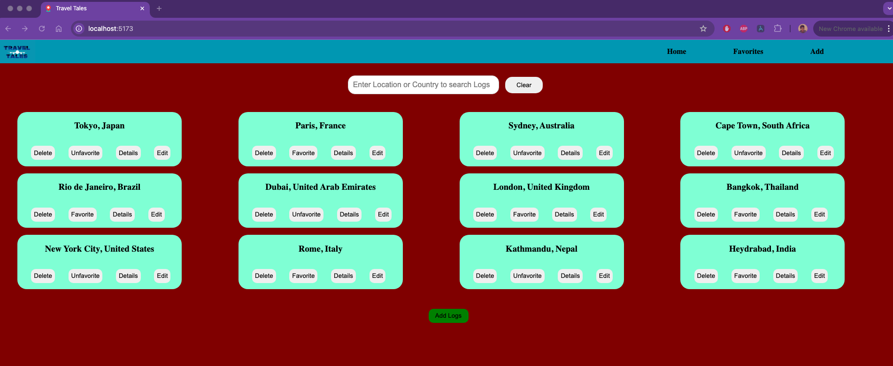
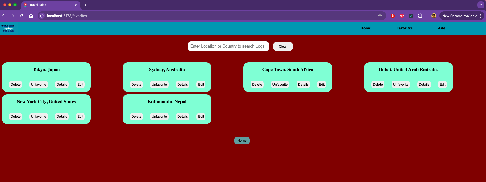
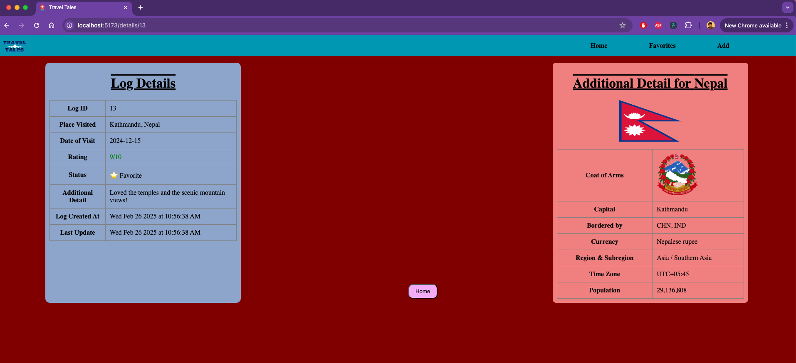
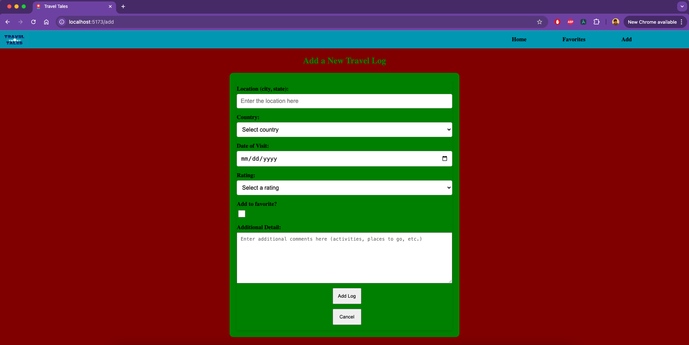
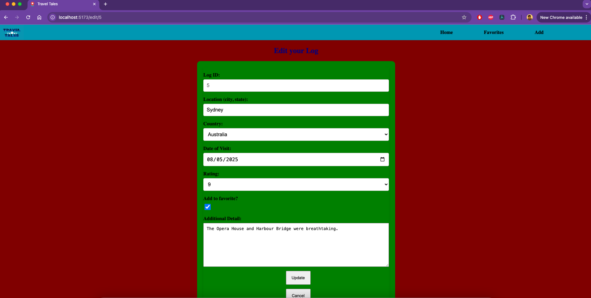

# Travel Log App

#### A full-stack MERN application to manage your travel logs, favorite locations, and much more.

## Installation Guide
- Clone the repo - git clone(url)
- Install dependencies - npm install
- start the server - npm run dev (backend server needs to be running as well)

## Description

Travel Log App allows users to log their travel experiences, mark places as favorites, and edit or delete entries. Built with the MERN stack, users can also view a list of their favorite places.

## Table of Contents

- [Technologies Used](#technologiesused)
- [Features](#features)
- [Design](#design)
- [Project Next Steps](#nextsteps)
- [Deployed App](#deployment)
- [About the Author](#author)

## Technologies Used

- MongoDB
- Express
- React
- Node.js
- JavaScript
- CSS3

## Features

- **Add Travel Logs**: Users can input travel details (location, country, date visited, rating, etc.).
- **Edit Travel Logs**: Update previously added travel logs.
- **Delete Travel Logs**: Remove logs that are no longer needed.
- **Favorite Locations**: Users can mark specific locations as favorites.
- **Details**: Users are able to view detail of their logs, 3rd party api will provide additional detail about that country in the details page.
- **View Favorites**: A separate page displays all of the user's favorite locations.
- **Search Functionality**: Allows users to search for logs by location or country.

## Design

The design incorporates a clean and simple interface to manage travel logs. The use of CSS3 and React components ensures a smooth user experience.

## Project Next Steps

#### List of Future Features

- Add **user authentication** for personalized travel logs.
- Implement **image uploads** for travel logs.
- Enhance the UI with animations and more engaging styling.
- Convert the frontend with react native to make it a mobile application.

## You can view the repository:

## Front-End

[Github.com](https://github.com/Sumanlamitare/travelTalesFE/)

## Back-End

[Github.com](https://github.com/Sumanlamitare/travelTalesBE)

## Other Links

[Developer LinkedIn](https://www.linkedin.com/in/sumanlamitare/)
